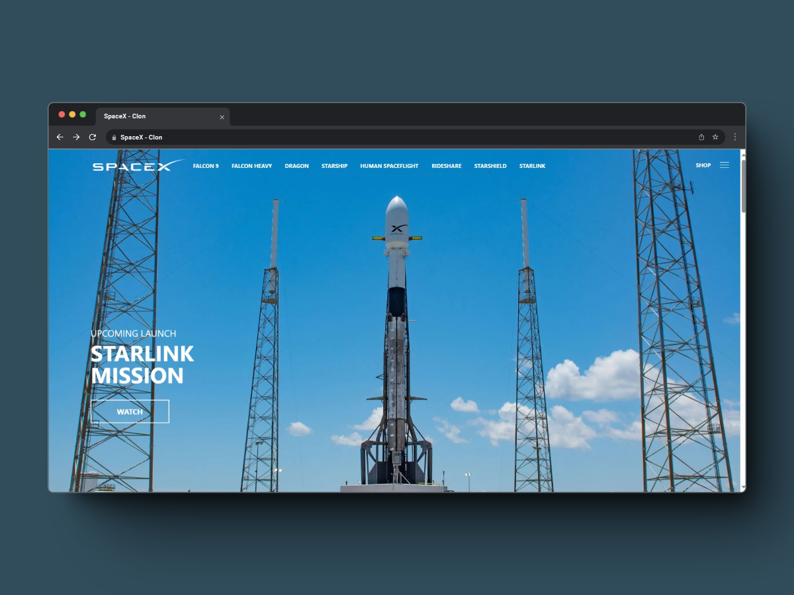

# Clon de la Página Web de SpaceX



Este proyecto es un clon de la página web oficial de SpaceX. El objetivo de este proyecto es aprender y mejorar las habilidades de desarrollo web, así como realizar algunas modificaciones y mejoras.

<article style="display:flex; column-gap: 10px">
    <span style="display:grid; place-items:center">
        <svg viewBox="0 0 256 366" xmlns="http://www.w3.org/2000/svg" width="50" height="50" preserveAspectRatio="xMidYMid"><path fill="#fff" d="M182.022 9.147c2.982 3.702 4.502 8.697 7.543 18.687L256 246.074a276.467 276.467 0 0 0-79.426-26.891L133.318 73.008a5.63 5.63 0 0 0-10.802.017L79.784 219.11A276.453 276.453 0 0 0 0 246.04L66.76 27.783c3.051-9.972 4.577-14.959 7.559-18.654a24.541 24.541 0 0 1 9.946-7.358C88.67 0 93.885 0 104.314 0h47.683c10.443 0 15.664 0 20.074 1.774a24.545 24.545 0 0 1 9.95 7.373Z"/><path fill="#FF5D01" d="M189.972 256.46c-10.952 9.364-32.812 15.751-57.992 15.751-30.904 0-56.807-9.621-63.68-22.56-2.458 7.415-3.009 15.903-3.009 21.324 0 0-1.619 26.623 16.898 45.14 0-9.615 7.795-17.41 17.41-17.41 16.48 0 16.46 14.378 16.446 26.043l-.001 1.041c0 17.705 10.82 32.883 26.21 39.28a35.685 35.685 0 0 1-3.588-15.647c0-16.886 9.913-23.173 21.435-30.48 9.167-5.814 19.353-12.274 26.372-25.232a47.588 47.588 0 0 0 5.742-22.735c0-5.06-.786-9.938-2.243-14.516Z"/></svg>
        <p>Astro</p>
    </span>
    <span style="display:grid; place-items:center">
        <svg viewBox="0 0 256 154" width="50" height="50" xmlns="http://www.w3.org/2000/svg" preserveAspectRatio="xMidYMid">
            <defs>
                <linearGradient x1="-2.778%" y1="32%" x2="100%" y2="67.556%" id="gradient">
                    <stop stop-color="#2298BD" offset="0%"></stop>
                    <stop stop-color="#0ED7B5" offset="100%"></stop>
                </linearGradient>
            </defs>
            <path d="M128 0C93.867 0 72.533 17.067 64 51.2 76.8 34.133 91.733 27.733 108.8 32c9.737 2.434 16.697 9.499 24.401 17.318C145.751 62.057 160.275 76.8 192 76.8c34.133 0 55.467-17.067 64-51.2-12.8 17.067-27.733 23.467-44.8 19.2-9.737-2.434-16.697-9.499-24.401-17.318C174.249 14.743 159.725 0 128 0ZM64 76.8C29.867 76.8 8.533 93.867 0 128c12.8-17.067 27.733-23.467 44.8-19.2 9.737 2.434 16.697 9.499 24.401 17.318C81.751 138.857 96.275 153.6 128 153.6c34.133 0 55.467-17.067 64-51.2-12.8 17.067-27.733 23.467-44.8 19.2-9.737-2.434-16.697-9.499-24.401-17.318C110.249 91.543 95.725 76.8 64 76.8Z" fill="url(#gradient)">
            </path>
        </svg>
        <p>Tailwind CSS</p>
    </span>
    <span style="display:grid; place-items:center">
        <svg xmlns="http://www.w3.org/2000/svg" width="50" height="50" viewBox="0 0 452 520">
        <path fill="#e34f26" d="M41 460L0 0h451l-41 460-185 52" />
        <path fill="#ef652a" d="M226 472l149-41 35-394H226" />
        <path fill="#ecedee" d="M226 208h-75l-5-58h80V94H84l15 171h127zm0 147l-64-17-4-45h-56l7 89 117 32z"/>
        <path fill="#fff" d="M226 265h69l-7 73-62 17v59l115-32 16-174H226zm0-171v56h136l5-56z"/>
        </svg>
        <p>HTML5</p>
    </span>
    <span style="display:grid; place-items:center">
        <svg xmlns="http://www.w3.org/2000/svg" width="50" height="50" viewBox="0 0 452 520">
        <path fill="#0c73b8" d="M41 460L0 0h451l-41 460-185 52"/>
        <path fill="#30a9dc" d="M226 472l149-41 35-394H226"/>
        <path fill="#ecedee" d="M226 208H94l5 57h127zm0-114H84l5 56h137zm0 261l-124-33 7 60 117 32z"/>
        <path fill="#fff" d="M226 265h69l-7 73-62 17v59l115-32 26-288H226v56h80l-6 58h-74z"/>
        </svg>
        <p>CSS</p>
    </span>
    <span style="display:grid; place-items:center">
        <svg xmlns="http://www.w3.org/2000/svg" width="50" height="50" viewBox="0 0 1052 1052"><path fill="#f0db4f" d="M0 0h1052v1052H0z"/><path d="M965.9 801.1c-7.7-48-39-88.3-131.7-125.9-32.2-14.8-68.1-25.399-78.8-49.8-3.8-14.2-4.3-22.2-1.9-30.8 6.9-27.9 40.2-36.6 66.6-28.6 17 5.7 33.1 18.801 42.8 39.7 45.4-29.399 45.3-29.2 77-49.399-11.6-18-17.8-26.301-25.4-34-27.3-30.5-64.5-46.2-124-45-10.3 1.3-20.699 2.699-31 4-29.699 7.5-58 23.1-74.6 44-49.8 56.5-35.6 155.399 25 196.1 59.7 44.8 147.4 55 158.6 96.9 10.9 51.3-37.699 67.899-86 62-35.6-7.4-55.399-25.5-76.8-58.4-39.399 22.8-39.399 22.8-79.899 46.1 9.6 21 19.699 30.5 35.8 48.7 76.2 77.3 266.899 73.5 301.1-43.5 1.399-4.001 10.6-30.801 3.199-72.101zm-394-317.6h-98.4c0 85-.399 169.4-.399 254.4 0 54.1 2.8 103.7-6 118.9-14.4 29.899-51.7 26.2-68.7 20.399-17.3-8.5-26.1-20.6-36.3-37.699-2.8-4.9-4.9-8.7-5.601-9-26.699 16.3-53.3 32.699-80 49 13.301 27.3 32.9 51 58 66.399 37.5 22.5 87.9 29.4 140.601 17.3 34.3-10 63.899-30.699 79.399-62.199 22.4-41.3 17.6-91.3 17.4-146.6.5-90.2 0-180.4 0-270.9z" fill="#323330"/></svg>
        <p>JavaScript</p>
    </span>
    <span style="display:grid; place-items:center">
        <svg viewBox="0 0 256 226" xmlns="http://www.w3.org/2000/svg" width="50" height="50" preserveAspectRatio="xMidYMid"><path fill="#05BDBA" d="M69.181 188.087h-2.417l-12.065-12.065v-2.417l18.444-18.444h12.778l1.704 1.704v12.778zM54.699 51.628v-2.417l12.065-12.065h2.417L87.625 55.59v12.778l-1.704 1.704H73.143z"/><path fill="#014847" d="M160.906 149.198h-17.552l-1.466-1.466v-41.089c0-7.31-2.873-12.976-11.689-13.174-4.537-.119-9.727 0-15.274.218l-.833.852v53.173l-1.466 1.466H95.074l-1.466-1.466v-70.19l1.466-1.467h39.503c15.354 0 27.795 12.441 27.795 27.795v43.882l-1.466 1.466Z"/><path fill="#05BDBA" d="M71.677 122.889H1.466L0 121.423V103.83l1.466-1.466h70.211l1.466 1.466v17.593zM254.534 122.889h-70.211l-1.466-1.466V103.83l1.466-1.466h70.211L256 103.83v17.593zM117.876 54.124V1.466L119.342 0h17.593l1.466 1.466v52.658l-1.466 1.466h-17.593zM117.876 223.787v-52.658l1.466-1.466h17.593l1.466 1.466v52.658l-1.466 1.465h-17.593z"/></svg>
        <p>Netlify</p>
    </span>
</article>

## 🚀 Mejoras realizadas

Se han implementado mejoras específicas en comparación con la página original de SpaceX.

### Scroll ajustable
> Al hacer scroll en mobile y desktop cada sección se ajusta a la pantalla.

### Mejora en el menú responsive.
> Al ir modificando el tamaño de la página, el menú se va ajustando ocultando algunas opciones y agregándolas en el menú lateral.

### Imágenes optimizadas
> Se optimizaron las imágenes utilizadas disminuyendo el tamaño que ocupan las imágenes.

### Icono de la página
> Se cambió el icono, en lugar de un archivo .ico se utiliza un svg.

## Estructura del Proyecto


```text
/
├── public/
│   ├── media/
│   │   ├── SpaceX-Section-1.webp
│   │   ├── SpaceX-Section-2.webp
│   │   ├── SpaceX-Section-3.webp
│   │   ├── SpaceX-Section-4.webp
│   │   ├── SpaceX-Section-5.mp4
│   │   ├── SpaceX-Section-6.webp
│   │   └── SpaceX.png
│   └── favicon.svg
├── src/
│   ├── components/
│   │   ├── icons/
│   │   │   ├── ChevronDownIcon.astro
│   │   │   └── SpaceXIcon.astro
│   │   ├── Header.astro
│   │   ├── ItemMenu.astro
│   │   └── Section.astro
│   ├── layouts/
│   │   └── Layout.astro
│   └── pages/
│       └── index.astro
└── package.json
```

## 🧞 Comandos

| Comandos                  | Acción                                           |
| :------------------------ | :----------------------------------------------- |
| `git@github.com:[R].git`  | Clon del repositorio (SSH)                       |
| `gh repo clone [R]`       | Clon del repositorio (GitHub CLI)                |
| `pnpm install`            | Instalación de dependencias                      |
| `pnpm dev`                | Iniciar el servidor local en `localhost:4321`    |
| `pnpm build`              | Construcción del proyecto `./dist/`              |
| `pnpm run astro ...`      | Ejecuta un comando `astro add`, `astro check`    |
| `pnpm run astro -- --help`| Obtén ayuda usando Astro CLI                     |

> [R] : FranciscoCastilleja/SpaceXClon